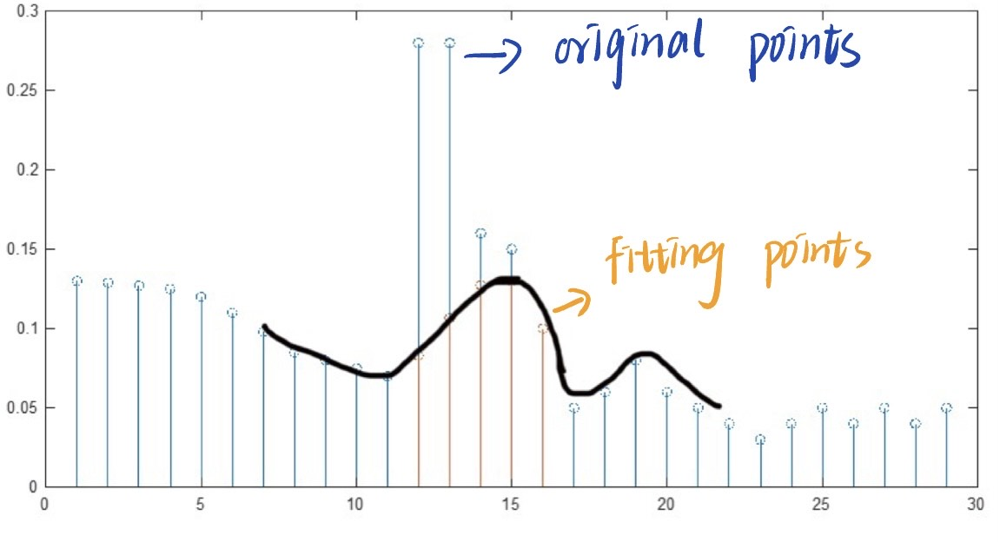
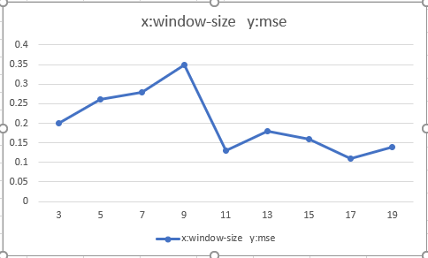
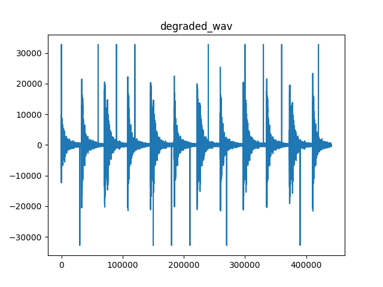
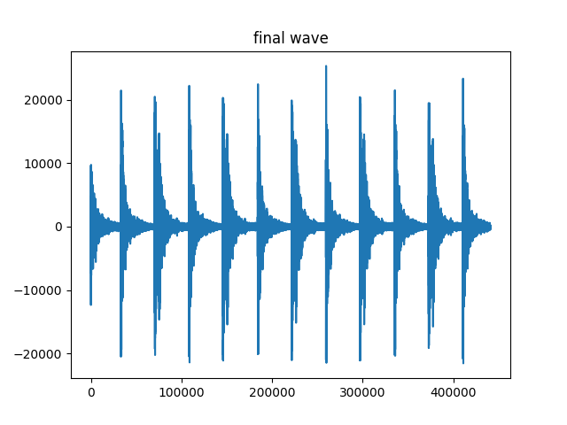
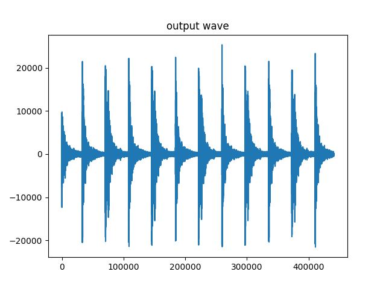

# Add here a title for the project
Audio Restoration in Python
 
## High-level Description of the project
This assignment builds on Assignment I. We assume that we have successfully detected the clicks and we are applying different interpolation methods to restore the audio, such as
- median filtering
- cubic splines

---

## Installation and Execution

Using 'pip3 install pipreqs' instruction to install requirements.txt environment.Then python libraries can be used automatically.For more details check [here](https://github.com/bndr/pipreqs)
Here are the used libraries in this project

```sh
matplotlib==3.6.2
numpy==1.23.4
playsound==1.2.2
tqdm==4.64.1
```


Afer installing all required packages you can run the demo file simply by typing:
```sh
python median_filter.py
python cubic_spines.py
```
---

## Methodology and Results
There are two methodologies in codes. 
1. Median filter 
The first step is to read 'clean_z.wav', 'degraded_z.wav' and 'detectionfile_z.wav' which from assignment1 with 'write_wav' and 'read_wav' function.The second step is to find the position of the clicks in the degraded audio.When a signal value is much greater than the surrounding signal value, it can be judged that the signal is click. Then define 'median_replece' function. In this function clicks will be grouped, and the window of the median filter will be found according to the length of the noise group.Use the median filter to find the median data of each click group.The principle is to pad zero in click signals, the number is (N-1)/2.And take out the data with the same length as the window, then take the middle datd to replace the detected clicks. These new data can create a new wav. The last step is to define a mse fuction which can caculate the mse of A and B. Unittest is used in my code. If the result  of Unittest is same with the result of my, code has no errors.

2. Cubic splines
The first step is to read 'clean_z.wav', 'degraded_z.wav' and 'detectionfile_z.wav' which from assignment1 with 'write_wav' and 'read_wav' function. After finding the position of the clicks, use the cubic splines function to fit the signals on both sides of the click.The example is shown in the figure below. We fit the equation with the coordinates of the 7-11 and 16-21 signals, and then bring them into the coordinates of the missing data points to find the fit.




**Results**

1. For the median filter, different lengths were explored to test the effectiveness of the restoration. In particular, window size 3, 5, 7, 9, 11, 13, 15, 17, 19 were tested and window size 17 was observed to deliver the lowest MSE, as shown in the figure below.



The restored waveform <output_medianFilter.wav> with the optimal filter length is given below:





2. Using the cubic splines, we observe the mse of this method is lower.

The restored waveform <output_cubicSplines.wav> with the optimal filter length is given below:





3. Comparing the two different interpolation methods, we notice that method cubic splines achieves a lower MSE. The average runtime of method median filter is about 40s, and the average runtime of cubic splines is about 14s. And after listening to the two restored files, we notice that method cubic splines can hear audio faster than method median filter.In conclution, method cubic splines performs better.


---
## Credits

This code was developed for purely academic purposes by Yuning Zhu as part of the module 5c22 computaional method assignments.


